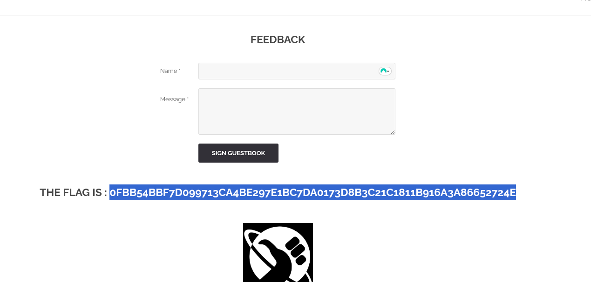

## COMMENT RÉCUPÉRER LE FLAG :

Sur la page d'accueil se trouve un accès à la page "Feedback"

Si on entre la balise `` dans la zone de texte "Message", le flag apparaît.

## COMMENT CORRIGER LA VULNÉRABILITÉ :

Pour corriger cette vulnérabilité de type Cross-Site Scripting (XSS), il est essentiel de ne jamais faire confiance aux entrées utilisateur. La meilleure pratique consiste à échapper ou à encoder toutes les données fournies par l'utilisateur avant de les afficher dans le HTML. Par exemple, remplacer les caractères spéciaux comme `<` par `&lt;`, `>` par `&gt;`, et `&` par `&amp;`. 
