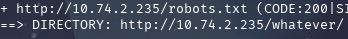

## COMMENT RÉCUPÉRER LE FLAG :

Lors de la phase de reconnaissance, en faisaint un `dirb http://10.74.2.235/` ,on constate la présence du répertoire *http://10.74.2.235/whatever/*

Lorsqu'on accède à cette page, on constate qu'il y a un fichier *htpasswd* que l'on peut télécharger.

Le fichier *htpasswd* contient des identifiants de login et de mot de passe, mais il est hashé en MD5.

On stocke `437394baff5aa33daa618be47b75cb49` dans un fichier hash.txt et on le déchiffre avec la commande `hashcat -m 0 hash.txt /usr/share/wordlists/rockyou.txt` 

On constate que le mot de passe est `qwerty123@`.

Avec le dirb, on constate un chemin vers une page de login en tant qu'administrateur.

On teste les identifiants récupérés, soit `admin` pour le login et `qwerty123@` pour le mot de passe. Cela nous permet de récupérer le flag.

## COMMENT CORRIGER LA VULNÉRABILITÉ :
Pour corriger la vulnérabilité, il est impératif de renforcer la sécurité des identifiants et de l'accès administrateur. 

Premièrement, le fichier `.htpasswd` ne doit jamais être accessible publiquement ; il devrait être déplacé en dehors du répertoire web racine ou son accès doit être restreint via la configuration du serveur (par exemple, avec `Require all denied` dans Apache). 

Deuxièmement, le hachage MD5 est obsolète et vulnérable aux attaques par dictionnaire et arc-en-ciel ; il est crucial de migrer vers des algorithmes de hachage plus robustes et salés comme bcrypt, scrypt ou Argon2 pour stocker les mots de passe.

Enfin, la page d'administration devrait être protégée par des mesures supplémentaires telles que l'authentification multi-facteurs (MFA), des politiques de mots de passe complexes et une limitation du taux de tentatives de connexion pour prévenir les attaques par force brute.

