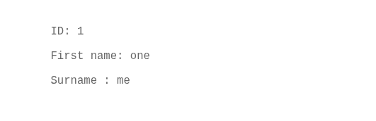
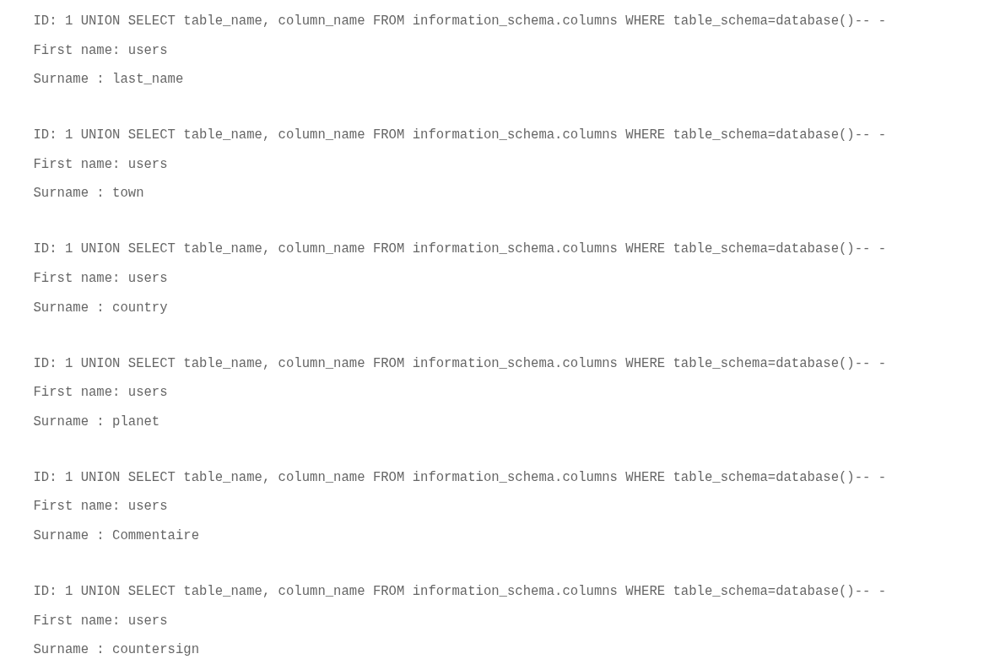
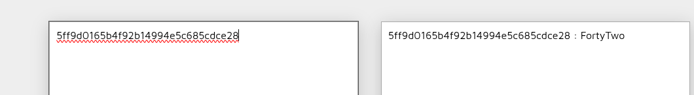
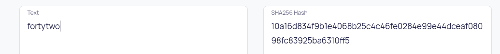

## COMMENT RÉCUPÉRER LE FLAG :

Dans la page "Members", nous avons un champ de recherche par ID. Nous allons d'abord regarder combien d'arguments sont attendus par la requête en faisant une entrée simple `1` dans le champ de recherche.

On voit que la requête attend 3 arguments. Nous allons donc entrer une injection SQL qui va nous permettre de trouver le nom de la table et le nom des colonnes. Cette injection est : `1 UNION SELECT table_name, column_name FROM information_schema.columns WHERE table_schema=database()-- -` 

Cette injection SQL utilise `UNION SELECT` pour extraire les noms de tables et colonnes de la base de données courante via `information_schema.columns`. Le `1` et les noms de colonnes remplacent les arguments de la requête originale, et `-- -` annule le reste de la requête.

Nous voyons que la table est nommée `users`, avec plusieurs colonnes dont `commentaire` et `countersign`. On va faire une injection SQL de la forme : `1 UNION SELECT commentaire,countersign FROM users` pour extraire les données de ces colonnes.

On voit que la colonne `commentaire` nous indique la méthode pour récupérer le flag et que la colonne `countersign` nous donne le hash MD5 du flag.

On réalise les étapes suivantes :

- Decrypter le hash MD5 du flag avec un outil en ligne :
 

On se retrouve avec le mot : `FortyTwo`.

- Écrire le mot en minuscule et encrypter ce mot en SHA256 avec un outil en ligne : 

## COMMENT CORRIGER LA VULNÉRABILITÉ :

Pour corriger la vulnérabilité d'injection SQL, la meilleure pratique consiste à utiliser des requêtes préparées (prepared statements) avec des paramètres liés (parameterized queries). 

Cette méthode sépare clairement les données fournies par l'utilisateur du code SQL de la requête, garantissant que toute entrée malveillante est traitée comme une simple valeur et non comme une partie exécutable de la commande SQL. Des exemples courants incluent l'utilisation de `?` ou de noms de paramètres (`:param`) dans la requête, puis le binding explicite des valeurs à ces placeholders, comme le permettent `sqlite3` en Python ou PDO en PHP.

