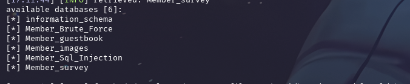
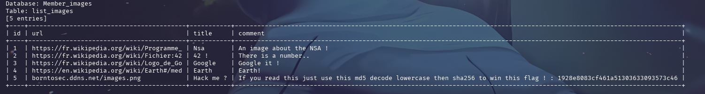

## COMMENT RÉCUPÉRER LE FLAG :

Avec l'utilitaire `sqlmap`, on va récupérer les bases de données. 
On réalise la commande suivante : `sqlmap -u http://[10.74.2.235]/?page=searchimg\&id=2\&Submit=Submit\ --level 3 --risk 3 --random-agent --tamper space2comment -dbs `

On récupère le nom de plusieurs bases de données, dont `Members_images`. 

On va ensuite les données présentes dans la base de données `Members_images`. 
On réalise la commande suivante : `sqlmap -u http://[10.74.2.235]/?page=searchimg\&id=2\&Submit=Submit\ --level 3 --risk 3 --random-agent --tamper space2comment -D Members_images --dump`

On obtient les données de la table `list_images`, avec des instructions à réaliser pour obtenir le flag. 

On réalise les étapes suivantes :

- Decrypter le hash MD5 du flag avec un outil en ligne :
 

On se retrouve avec le mot : `albatroz`.

- Écrire le mot en minuscule et encrypter ce mot en SHA256 avec un outil en ligne : 

On récupère le flag ! 

## COMMENT CORRIGER LA VULNÉRABILITÉ :

Pour corriger cette vulnérabilité d'injection SQL, la méthode la plus efficace est l'utilisation de requêtes préparées (Prepared Statements) ou de requêtes paramétrées. Au lieu de concaténer directement les entrées utilisateur dans la requête SQL, ces techniques séparent la logique de la requête des données, garantissant que les entrées sont traitées comme des valeurs et non comme du code exécutable. 

Par exemple, en PHP avec PDO, on utiliserait `prepare()` et `execute()` avec des marqueurs de position ou nommés. En parallèle, une validation rigoureuse des entrées utilisateur est cruciale, en s'assurant que les données correspondent au format attendu (par exemple, un entier pour un ID, une chaîne de caractères alphanumérique pour un nom) et en échappant ou en rejetant tout caractère potentiellement malveillant.
