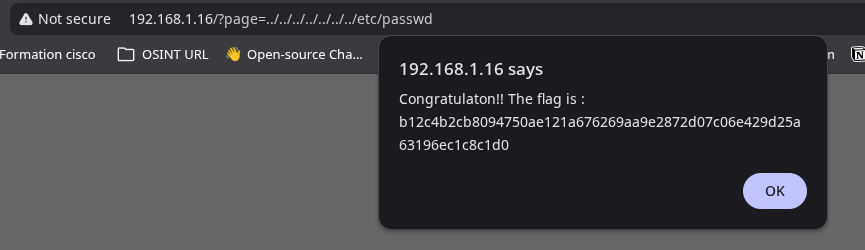

## COMMENT RÉCUPÉRER LE FLAG : 

Pour récupérer le flag, nous allons réaliser une attaque de type Path Traversal. Directement dans l'URL, on va ajouter `../../etc/passwd` avec le nombre de `../` nécessaire pour arriver au dossier `/etc/passwd` ou récuperer le flag. 

## COMMENT CORRIGER LA VULNÉRABILITÉ :
Pour corriger la vulnérabilité de Path Traversal, il est crucial de ne jamais faire confiance aux entrées utilisateur lors de la construction de chemins de fichiers. Une approche efficace consiste à valider et à nettoyer toutes les entrées. 

Par exemple, on peut utiliser une liste blanche de noms de fichiers autorisés ou s'assurer que le chemin résolu ne sort pas d'un répertoire de base défini (chroot). Des fonctions comme `path.normalize()` ou `os.path.abspath()` peuvent aider à nettoyer les chemins, mais elles doivent être combinées avec une vérification stricte pour s'assurer que le chemin final reste dans le répertoire prévu. Il est également recommandé de ne pas stocker de fichiers sensibles dans des répertoires accessibles via des requêtes HTTP.

