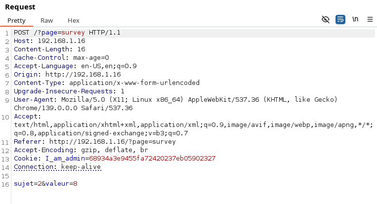
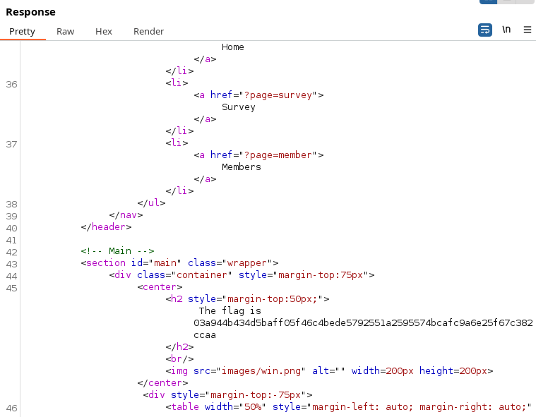

## COMMENT RÉCUPÉRER LE FLAG : 

Sur la page d'accueil, on trouve une page `Survey, où on peut modifier une valeur comprise entre 1 et 10. 
Si on analyse la requête HTTP, on peut voir que la valeur est envoyée ici est 8. 

On envoie une requête HTTP avec une valeur plus élevée, et dans la réponse, on obtient notre flag. 

## COMMENT CORRIGER LA VULNÉRABILITÉ : 
Cette vulnérabilité est due à un manque de validation côté serveur des paramètres soumis par l'utilisateur. En manipulant la valeur du sondage (`survey value`) dans la requête HTTP, un attaquant peut contourner les restrictions prévues et accéder à des informations sensibles (le "flag" dans ce cas). 

Pour corriger cela, il est impératif d'implémenter une validation stricte côté serveur pour tous les inputs utilisateur, en s'assurant que les valeurs sont dans les plages attendues et que l'utilisateur est autorisé à effectuer l'action demandée. Par exemple, pour une valeur numérique, vérifier `if (value >= 1 && value <= 10)` est crucial avant tout traitement. Il est également recommandé de ne jamais se fier uniquement à la validation côté client, car elle est facilement contournable.
