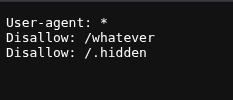
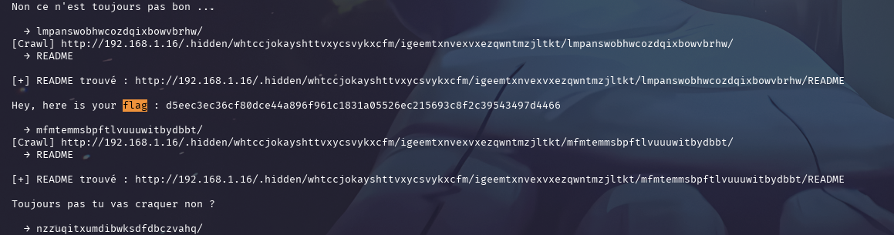

## COMMENT RÉCUPÉRER LE FLAG : 

Lorsqu'on analyse la page `robots.txt`, on peut voir qu'il y a un dossier `.hidden`.

Ce dossier mène à plusieurs sous-dossiers dans des sous-dossiers avec un `README.md` à la fin de la chaîne. 

En écrivant un script Python, on peut récupérer le flag. 

## COMMENT CORRIGER LA VULNÉRABILITÉ : 

Pour corriger cette vulnérabilité, il est essentiel de ne pas s'appuyer sur `robots.txt` comme mesure de sécurité, car il est destiné à guider les robots d'indexation et non à restreindre l'accès aux utilisateurs malveillants. La meilleure pratique consiste à implémenter des contrôles d'accès robustes pour les répertoires et fichiers sensibles. Cela inclut l'utilisation de l'authentification (par exemple, `.htaccess` avec mot de passe), la configuration de permissions de fichiers strictes sur le serveur, ou le déplacement des informations confidentielles (comme les flags) hors de l'arborescence accessible via le serveur web. Par exemple, les flags devraient être stockés dans des variables d'environnement ou une base de données sécurisée, plutôt que dans des fichiers `README.md` directement accessibles.
