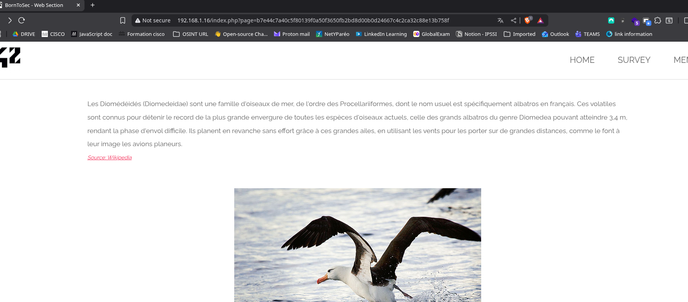
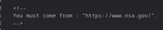
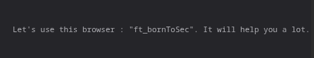
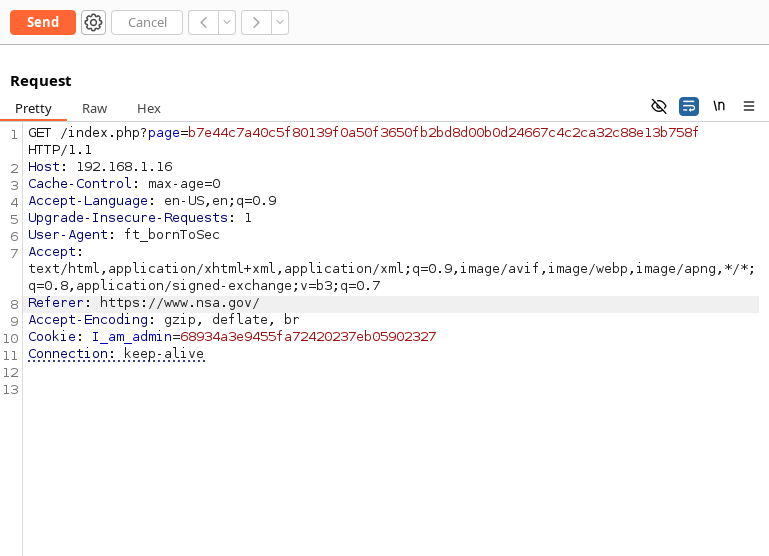
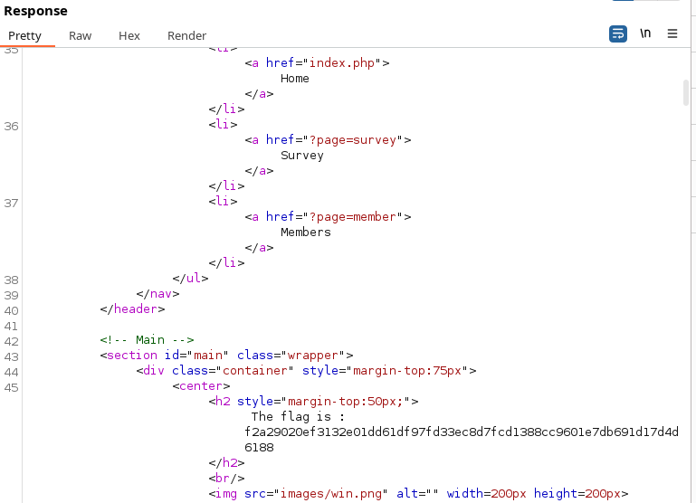

## COMMENT RÉCUPÉRER LE FLAG : 

Sur le base de le page d'accueil, on peut voir qu'il y a un lien vers une page cachée en cliquant sur le bouton "Copyright".

Dans le code source de la page, on peut voir qu'on nous conseille de nous d'utiliser le navigateur `ft_bornToSec` et d'être originaire de l'URL `https://www.nsa.gov/`. 

 

À l’aide de l’outil Burp Suite, j’ai intercepté la requête associée et j’ai modifié manuellement deux en-têtes : `Referer` et `User-Agent`. Ces derniers sont parfois utilisés comme mécanismes de vérification d’origine, bien qu’ils soient facilement falsifiables.

À l'aide des indices trouvés dans le code source, j'ai modifié les en-têtes de la requête HTTP de la manière suivante :
 -  Referer : https://www.nsa.gov/
 -  User-Agent : ft_bornToSec

En envoyant la requête modifiée, j'ai reçu une réponse HTTP avec un corps de réponse contenant le flag.

## COMMENT CORRIGER CETTE VULNÉRABILITÉ ?
Pour corriger cette vulnérabilité, il est crucial de ne pas se fier uniquement aux en-têtes HTTP tels que `Referer` ou `User-Agent` pour des contrôles de sécurité, car ils sont facilement falsifiables par un attaquant. Une bonne pratique consiste à implémenter des mécanismes de vérification côté serveur plus robustes. Par exemple, l'accès à des pages sensibles devrait être protégé par une authentification et une autorisation appropriées, en utilisant des jetons de session sécurisés (CSRF tokens), des cookies HTTP Only et Secure, ou en vérifiant les droits d'accès de l'utilisateur via une base de données. Si la page est destinée à un usage interne ou spécifique, une restriction par adresse IP ou un VPN peut également être envisagée. En somme, la sécurité ne doit pas reposer sur l'obscurité ou des informations contrôlables par le client.
