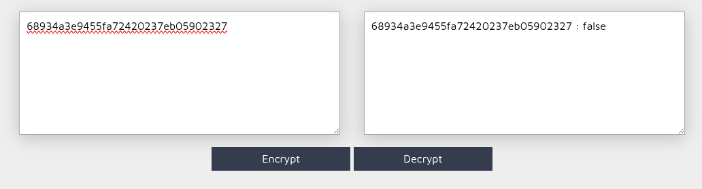
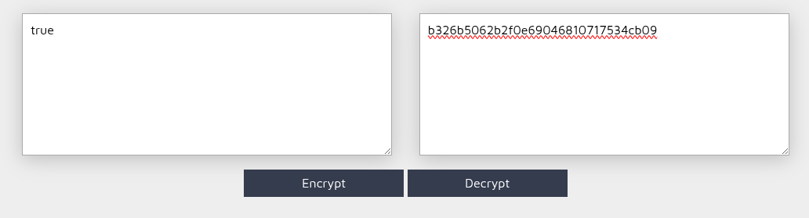
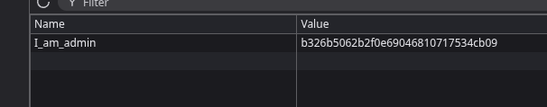

## COMMENT RÉCUPERER LE FLAG ? 

En regardant les informations d'une requête HTTP, on peut voir qu'on a un cookie `I_am_admin=68934a3e9455fa72420237eb05902327`

On peut voir que le cookie est enregistré en session, donc on peut le modifier pour avoir accès à un flag. 

On constate que le cookie est hashé en MD5, et qu'il correspond à la valeur `false`. 

On va modifier cette valeur en `true` pour avoir accès au flag.

On modifie le cookie sur une page du site. 

On récupère le flag !

## COMMENT CORRIGER CETTE VULNÉRABILITÉ ? 

Pour corriger cette vulnérabilité, il est crucial de ne jamais stocker d'informations sensibles ou d'autorisation directement côté client dans des cookies, surtout pas de manière facilement modifiable ou prévisible (comme un hash MD5 d'une valeur booléenne simple). La gestion des sessions doit être impérativement effectuée côté serveur, où l'état de l'utilisateur (par exemple, son statut d'administrateur) est stocké de manière sécurisée et associé à un identifiant de session unique et cryptographiquement robuste, transmis via un cookie `HttpOnly` et `Secure`. Les contrôles d'autorisation doivent être effectués à chaque requête sur le serveur, en vérifiant l'état de la session liée à l'utilisateur, plutôt que de se fier à une valeur client potentiellement falsifiée.
