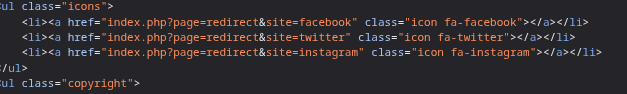
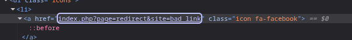
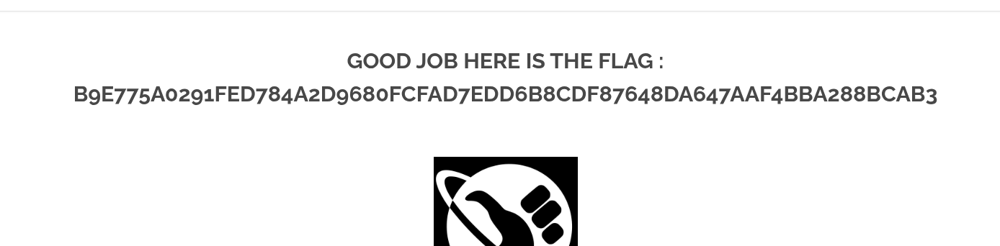

## COMMENT RÉCUPERER LE FLAG ?

Lorsqu'on regarde le code source de la page, on constate que les liens de redirection des icônes en bas de page sont des redirections vers des pages externes.

On va donc modifier une de ces redirections pour qu'elle redirige vers une autre page et génère un flag ou une erreur. 

Lorsqu'on clique sur le lien, on est redirigé vers une page avec un flag.

## COMMENT CORRIGER CETTE VULNÉRABILITÉ ? 
Pour corriger cette vulnérabilité de redirection, il est essentiel de valider toutes les destinations de redirection côté serveur. Les bonnes pratiques incluent l'utilisation d'une liste blanche (whitelist) de domaines ou de chemins autorisés, la vérification que les URLs de redirection sont relatives ou pointent vers des sous-domaines contrôlés, et l'assainissement de toute entrée utilisateur avant de l'utiliser dans une redirection. Par exemple, au lieu d'accepter `?redirect_to=http://malicious.com`, le serveur devrait s'assurer que `redirect_to` correspond à `/dashboard` ou `https://monapplication.com/profil`.
