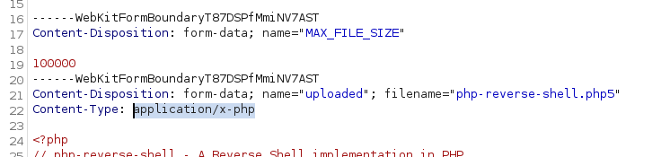
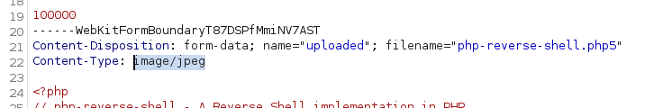
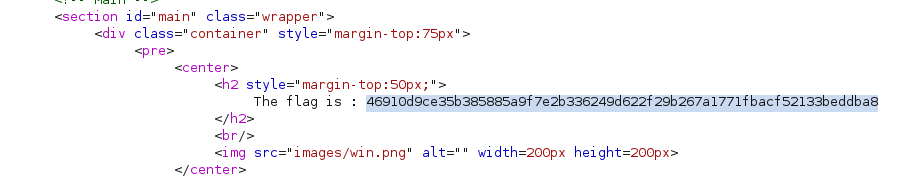

## COMMENT RÉCUPERER LE FLAG ? 

Sur la page d'accueil, on constate qu'il y a un formulaire pour uploader un fichier, sauf que le fichier doit être une image.

On va uploader un fichier php et modifier le header pour qu'il soit interprété comme une image.

On va modifier le `Content-Type : application/x-php` en `Content-Type : image/jpeg`.

On recupère bien le flag.

## COMMENT CORRIGER CETTE VULNÉRABILITÉ ? 
Pour corriger cette vulnérabilité de contournement de l'upload de fichiers, il est impératif de ne pas se fier uniquement au `Content-Type` fourni par le client, car il peut être facilement falsifié. Il est recommandé de mettre en place une validation stricte côté serveur, incluant la vérification des "magic bytes" du fichier pour confirmer son type réel (par exemple, `0xFFD8` pour un JPEG), et potentiellement un redimensionnement ou un traitement d'image pour s'assurer que le fichier est bien une image valide. De plus, il est crucial de restreindre les types de fichiers autorisés via une liste blanche d'extensions (`.jpg`, `.png`, `.gif` uniquement) et de s'assurer que le répertoire d'upload n'a pas les permissions d'exécution de scripts. Enfin, renommer les fichiers téléchargés avec un nom généré aléatoirement et une extension forcée peut également réduire les risques.
