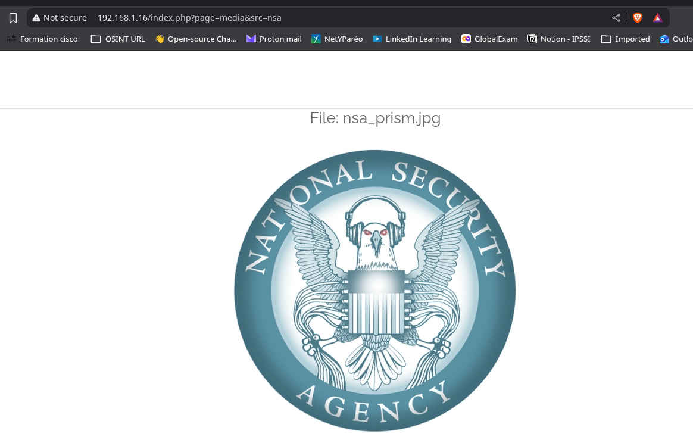
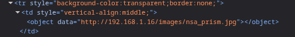
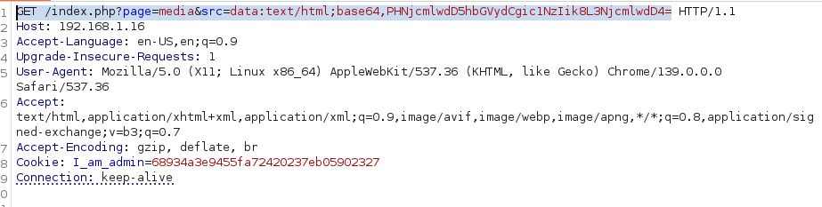
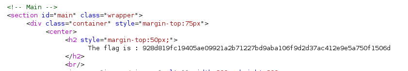

## COMMENT RÉCUPÉRER LE FLAG ?

Sur la page d'accueil, il y a une image qui nous renvoie sur une autre page de type `http://IP/index.php?page=media&src=nsa`

On remarque que l'image est appelée avec la balise `<object>`

On pourrait donc réaliser une attaque XSS mais il faut que l'attaque soit encodée en base64. 

On va encoder ``  en base64, ce qui nous donne `PHNjcmlwdD5hbGVydCgic1NzIik8L3NjcmlwdD4=`

On va donc enforger une requête GET avec la variable `src` qui contiendra notre code encodé en base64 : 

On recupére bien notre flag :

## COMMENT CORRIGER CETTE VULNÉRABILITÉ ?

Pour corriger cette vulnérabilité XSS, il est impératif de ne jamais faire confiance aux entrées utilisateur. La première étape consiste à valider et à filtrer rigoureusement toutes les données provenant de l'utilisateur, comme le paramètre `src`. Il faut s'assurer que les valeurs correspondent à un format attendu ou à une liste blanche de valeurs autorisées. Par exemple, si `src` doit être un nom de fichier, vérifiez qu'il ne contient que des caractères alphanumériques et des points, et qu'il ne tente pas de naviguer dans l'arborescence des fichiers (`../`). Ensuite, lors de l'affichage de ces données sur la page web, il est crucial d'appliquer un encodage de sortie approprié. Pour le contenu HTML, cela signifie convertir les caractères spéciaux (comme `<`, `>`, `&`, `"`, `'`) en leurs entités HTML correspondantes (`&lt;`, `&gt;`, `&amp;`, `&quot;`, `&#x27;`). La plupart des frameworks web modernes offrent des fonctions d'encodage HTML intégrées. Enfin, l'implémentation d'une Content Security Policy (CSP) robuste peut servir de couche de défense supplémentaire, en limitant les sources de contenu que le navigateur est autorisé à charger et à exécuter.
