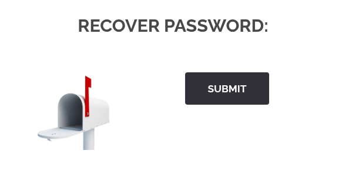
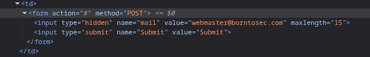
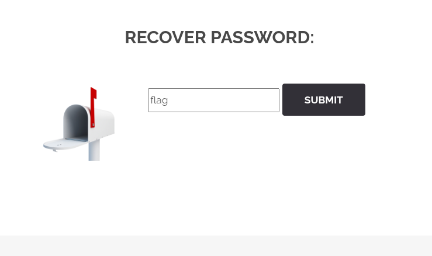
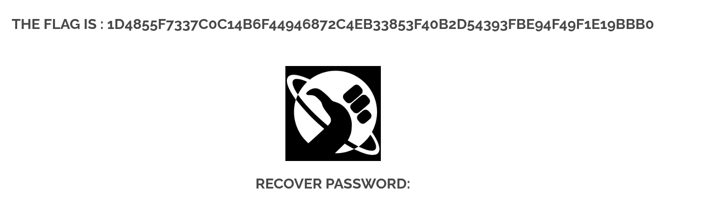

## COMMENT RÉCUPÉRER LE FLAG ?

Sur la page de connexion, il y a un lien qui nous ramène vers une page de mot de passe oublié.

En analysant le code source, on constate un champ `hidden`dans le formulaire.

En décodant le champ `hidden`, on a accès à un champ du formulaire.

On entre une valeur dans le champ et on récupère le flag.

## COMMENT CORRIGER CETTE VULNÉRABILITÉ ?

Pour corriger cette vulnérabilité, il est crucial de ne jamais faire confiance aux données envoyées par le client, même si elles sont dans un champ `hidden`. Le serveur doit toujours valider et traiter toutes les informations reçues. Dans ce cas spécifique, le champ `hidden` ne devrait pas contenir d'informations sensibles ou des mécanismes permettant d'accéder directement à des ressources protégées. Une bonne pratique serait de générer un jeton unique et temporaire côté serveur, de l'envoyer à l'utilisateur via un canal sécurisé (comme un e-mail de réinitialisation de mot de passe), puis de valider ce jeton sur le serveur avant d'autoriser toute action. De plus, il est essentiel de ne jamais stocker des informations comme le flag directement dans le code source client, même encodées, car elles peuvent être facilement découvertes et exploitées.
